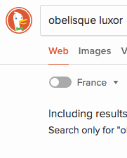

DuckDuckGo Region Filter Toggle Shortcut
========================================

Adds a keyboard shortcut to toggle the region filter on DuckDuckGo.

## Demo

## Install
Open the [raw script][1] and click “Install” in the resulting dialog. A [more
detailed explanation][2] is available on the Greasemonkey wiki.

## License
Copyright © 2018 Teddy Wing. Licensed under the GNU GPLv3+ (see the included
COPYING file).

[1]: https://raw.githubusercontent.com/teddywing/duckduckgo-region-filter-toggle-shortcut/master/duckduckgo-region-filter-toggle-shortcut.user.js
[2]: https://wiki.greasespot.net/Greasemonkey_Manual:Installing_Scripts
